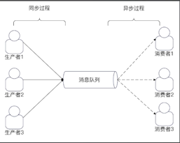
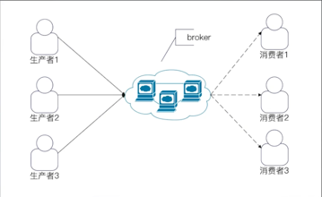
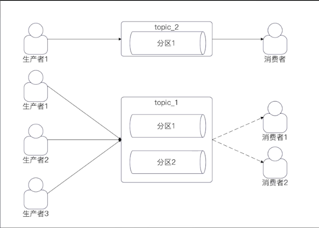
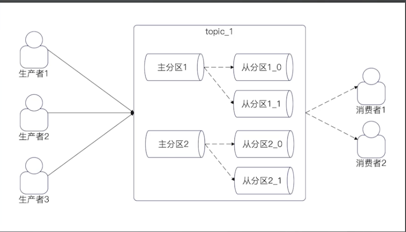
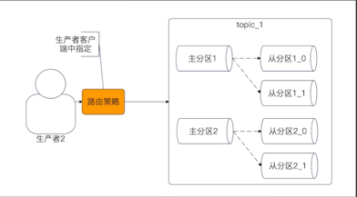
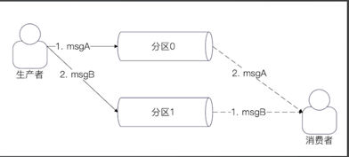
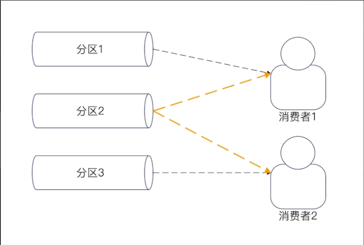

# Kafka 概念入门

## 消息队列
> Kafka是消息队列的一种实现，类似的还有RocketMQ和RabbitMQ。

消息队列的基本形态，就是有N个生产者，N个消费者。

在这种形态下，生产者和消费者就解耦了

## kafka基本盖严
Kafka的设计比较复杂，设计的知识点很多，但是基本上都是围绕这些基本概念来进行的。
* 生产者producer
* 消费者consumer
* broker，也可以理解为消息服务器
* topic与分区（partition）
* 消费者组与消费者

下图是生产者、消费者和broker三者之间的关系。

Broker的意思是“中间人”，是一个逻辑上的概念。
在实践中，一个broker就是一个消息队列进程，也可以认为一个broker就是一台机器

## topic和分区
Topic是消息队列上代表不同的业务的东西。

简单来说，一个业务就是一个topic。

而一个topic有多个分区。

如下图中，topic1有两个分区，而topic2有一个分区。

## 主分区和从分区
实际上，我们说某个topic有多少个分区的时候，值得是有多少个主分区。

但是事实上，Kafka为了保证高可用和数据不丢失，分区有主分区和从分区。

当 发送消息到Kafka上的时候，Kafka会把消息写入主分区之后，再同步到主分区。

如图，每一个分区实际上是一主两从的结构。

## 分区和broker的关系
正常情况下，同一个topic的分区会尽量平均分散到所有的broker上。

这就意味着两件事：
* 主分区之间，不会在同一个broker上。
* 同一个分区的主分区和从分区，也不会在同一个broker上。

核心目标：保证当某个broker崩毁的时候，对业务的影响最小。
满足上面的两个要求的话，某一个broker崩溃，
最多导致topic的某一个主分区不可用，不至于完全不可以用。

## 分区和生产者的关系
正常情况下，一个topic都会有多个分区，所以发送者在发送消息的时候，就需要选择一个目标分区。
比较常用的有三种：
* 轮询：一个分区发送一次，挨个轮流
* 随机：随机挑选一个
* 哈希：根据消息中的key来筛选一个目标分区

也可以自己设计一些比较复杂的路由策略，用在面试中效果会比较好。

## 分区和消息有序性
Kafka中的消息有序性保证是以分区为单位的。

也就是说，一个分区内的消息是有序的。即，消息在一个分区内的顺序，就是分区的消息被消费的顺序。

因此如果要做到全局有序，就只能有一个分区。

如果要做到业务有序，就需要保证业务的消息都丢掉同一个分区里面。

图中是一个不同分区上的消息失序的例子。生产者发送msgA和msgB，但是消费者的消费顺序是msgB、msgA

## 分区和消费者组、消费者的关系
在Kafka中，消费者都是归属于某一个消费者组的。

一个消费者组可以看作是关心这个topic的一个业务方。
比如说在创建用户的时候，搜索关心新用户，推荐也关心新用户，那么搜索自己是一个消费者组，
推荐也是一个消费者组。

同一个消费者组里面，一个分区最多只有一个消费者。
也就是在同一个消费者组里面：
* 一个消费者可以消费多一个分区的数据。
* 一个分区在同一时刻，只可能被一个消费者消费。

## 最多个一个消费者的内涵
一个分区最多一个消费者！

图中分区2被两个消费者消费，这种事不允许的。

由此衍生出来：
* 如果一个topic有N个分区，那么同一个消费组最多有N个消费者。多余这个数字的消费者会被忽略。
* 如果消费者性能很差，那么并不能通过无限增加消费者来提高消费速率。

这就是典型的面试热点：消息积压问题