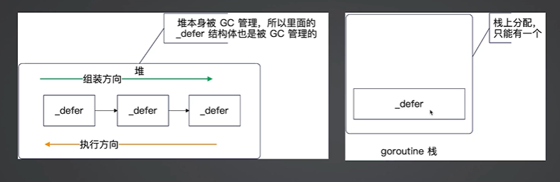
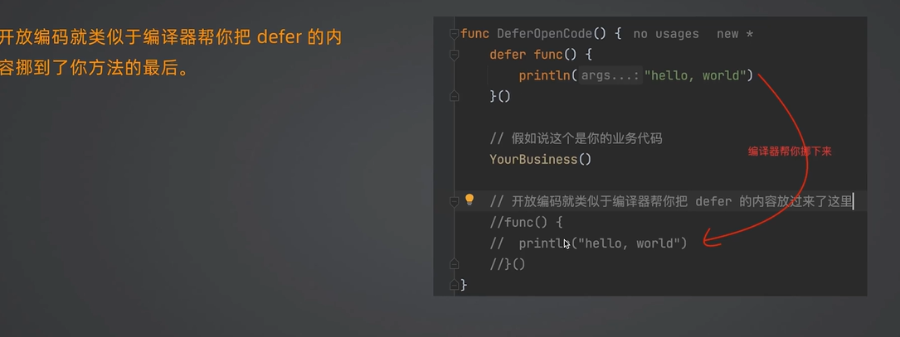
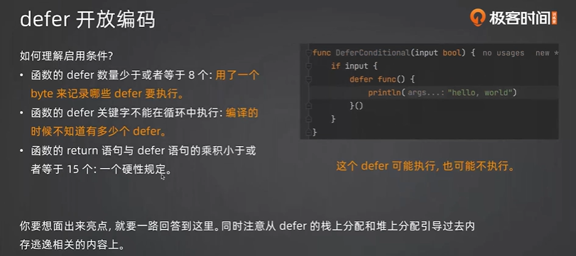

# defer实现机制
> defer的内部实现分成三种机制
> * **堆上分配**:是指整个defer直接配分到堆上，缺点就是要被GC管理。
> * **栈上分配**:整个defer分配到了goroutine栈上，不需要被GC管理，比堆上分配性能提升了30%
> * **开放编码(Open Code)**:启用内联的优化，直观理解就是相当于把你的defer内容放到了你的函数随后。启用条件：
>   * 函数的defer数量少于或者等于8个；
>   * 函数的defer关键字不能再循环中执行；
>   * 函数的return语句与defer语句的乘积小于或者等于15个。

## defer堆上分配与栈上分配

## 开放编码

