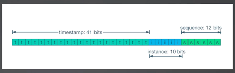

# 雪花算法

>  **雪花算法基本原理**
> * 1比特保留位，图中没有画出来
> * 41比特位的时间戳
> * 10比特的机器位，一般叫做Worker ID
> * 12比特的自增序号

**雪花算法在Go里面有一个很好用的库 [github.com/bwmarrin/snowflake](github.com/bwmarrin/snowflake)。**

使用起来也很简单，就是创建一个Node，然后传入一个WorkerID。这里的WorkerID就是雪花算法中代表的10比特，因此最多有`2^10=1024`个节点

后续就可以生成各种ID。

