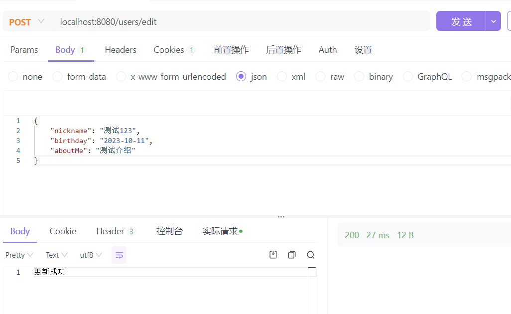

# 第二周作业

需要完善 /users/edit 对应的接口。要求：

* 允许用户补充基本个人信息，包括： 
  * 昵称：字符串，你需要考虑允许的长度。 
  * 生日：前端输入为 1992-01-01 这种字符串。 
  * 个人简介：一段文本，你需要考虑允许的长度。
* 尝试校验这些输入，并且返回准确的信息。
* 修改 /users/profile 接口，确保这些信息也能输出到前端。
## 代码
查看代码：[user.go](../../webook/internal/web/user.go)
## 实现效果

---
