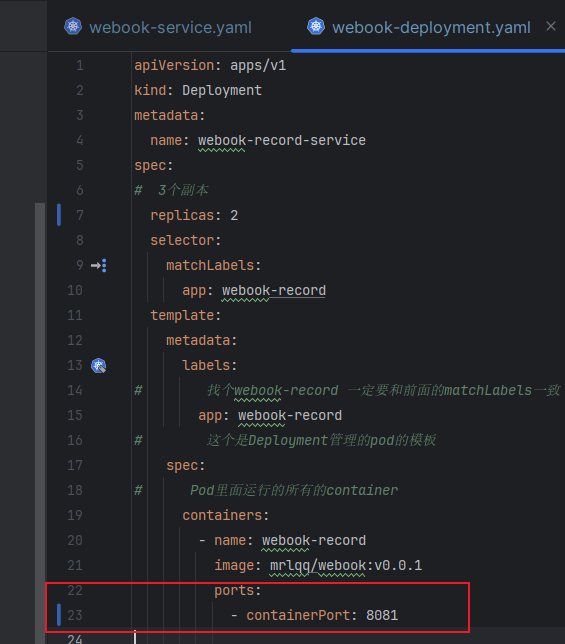
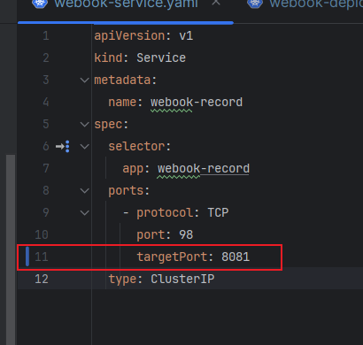
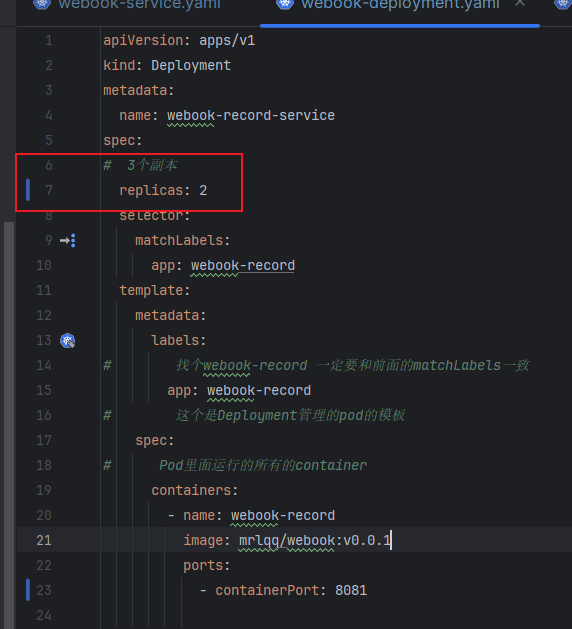
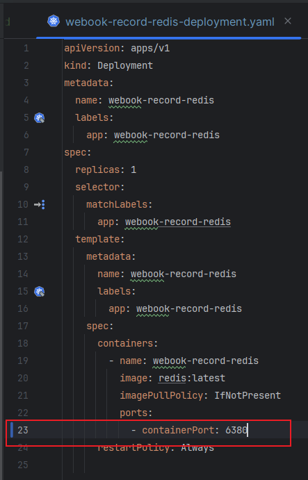
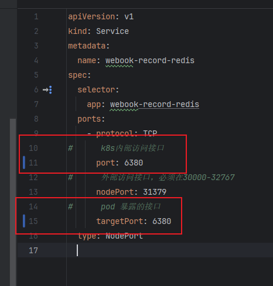
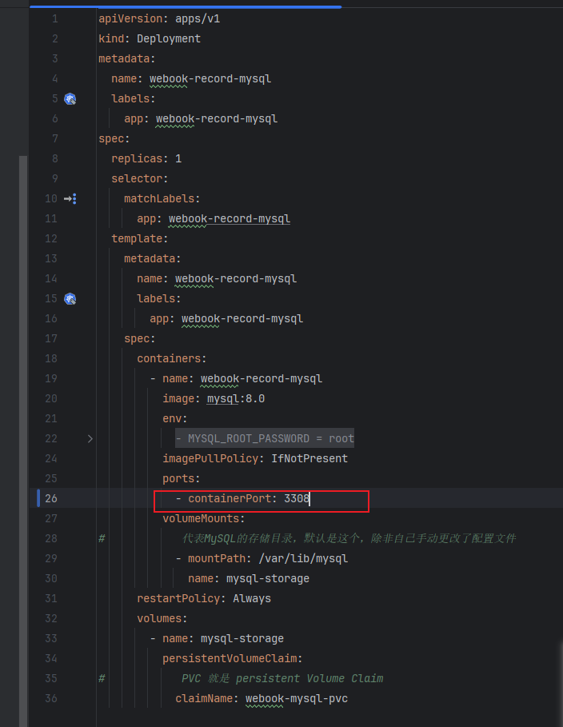
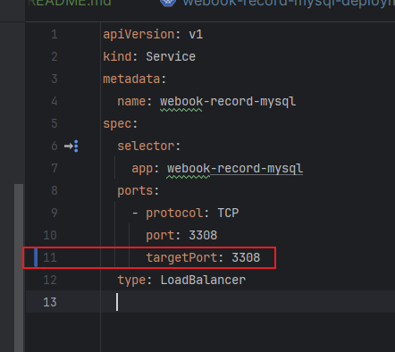

# 第二周作业
* 将 webook 的启动端口修改 8081。
* 将 webook 修改为部署 2 个 Pod。
* 将 webook 访问 Redis 的端口修改为 6380。
* 将 webook 访问 MySQL 的端口修改为 3308。

> 由于本地win系统,k8s安装多次失败，所以只能进行理论性的学习。对于作业已完成对应的配置文件编写，后续k8s安装成功后，会进行相应的测试。

1. 将 webook 的启动端口修改 8081。
> 查看文件：[webook-deployment.yaml](../../webook/webook-deployment.yaml)、[webook-deployment.yaml](../../webook/webook-service.yaml)

2. 将 webook 修改为部署 2 个 Pod。
> 查看文件：[webook-deployment.yaml](../../webook/webook-deployment.yaml)

3. 将 webook 访问 Redis 的端口修改为 6380。
> 查看文件：[webook-record-redis-deployment.yaml](../../webook/webook-record-redis-deployment.yaml)、[webook-record-redis-service.yaml](../../webook/webook-record-redis-service.yaml)

4. 将 webook 访问 MySQL 的端口修改为 3308。
> 查看文件：[webook-record-mysql-deployment.yaml](../../webook/webook-record-mysql-deployment.yaml)、[webook-record-mysql-service.yaml](../../webook/webook-record-mysql-service.yaml)

