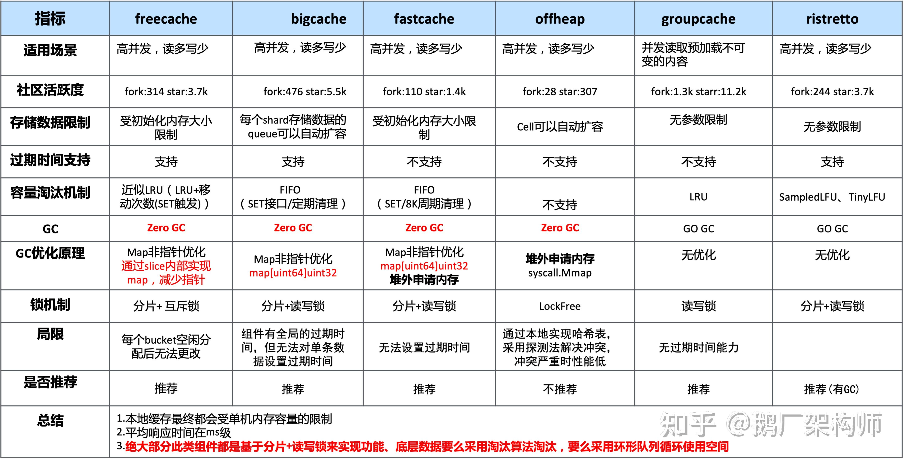

# 第4周作业

> 不使用 Redis 作为缓存，提供一个基于本地缓存实现的 cache.CodeCache。
> * 定义一个 CodeCache 接口，将现在的 CodeCache 改名为 CodeRedisCache。
> * 提供一个基于本地缓存的 CodeCache 实现。你可以自主决定用什么本地缓存，在这个过程注意体会技术选型要考虑的点。
> * 保证单机并发安全，也就是你可以假定这个实现只用在开发环境，或者单机环境下。

## 本地缓存需求分析
由于需要代替redis实现手机验证码存储和验证的功能。所以分析手机验证码的需求可以得出一下几个结论：
* 手机验证码是有时效性的，表示所用到的本地缓存支持过期时间
* 手机验证码是字符串类型，表示所用到的本地缓存支持字符串类型的数据
* 手机验证码是线程安全的，表示所用到的本地缓存支持多线程并发访问

## 本地缓存组件选型
golang中本地缓存方案可选的有如下一些：

1、[freecache](https://github.com/coocood/freecache)  
2、[bigcache](https://github.com/allegro/bigcache) 
3、[fastcache](https://github.com/VictoriaMetrics/fastcache) 
3、[offheap](https://github.com/glycerine/offheap) 
5、[groupcache](https://github.com/golang/groupcache) 
6、[ristretto](https://github.com/dgraph-io/ristretto) 
7、[go-cache](https://github.com/patrickmn/go-cache) 

golang可选的开源本地缓存组件汇总为下表：

| 缓存组件 | 语言 | 适用场景 | 官方地址 |
| --- | --- | --- | --- |
| freecache | Go | 内存小数据量，对读写性能要求高 | https://github.com/coocood/freecache |
| bigcache | Go | 内存大数据量，对读写性能要求高 | https://github.com/allegro/bigcache |
| fastcache | Go | 内存小数据量，对读写性能要求高 | https://github.com/VictoriaMetrics/fastcache |
| offheap | Go | 内存大数据量，对读写性能要求高 | https://github.com/glycerine/offheap |
| groupcache | Go | 内存小数据量，对读写性能要求高，支持分布式缓存 | https://github.com/golang/groupcache |
| ristretto | Go | 内存小数据量，对加密解密性能要求高，支持分布式缓存 | https://github.com/dgraph-io/ristretto |
| go-cache | Go | 内存小数据量，对读写性能要求高，支持过期时间和LRU策略 | https://github.com/patrickmn/go-cache |

这里我选用freecache作为本地的缓存库

1、使用本地缓存存储验证码

2、使用本地缓存校验验证码

> 查看文件：[cache/code.go](../../webook/internal/repository/cache/code.go)